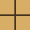
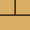

# README Go demo
public integration test for README Go.

<!-- README_GO:START -->
## Play Go in this README

Choose any linked empty intersection to propose the next move.

**White to play · action 22**

Black captures: 0 · White captures: 0

 
 
 
 
 
 
 
 
 

Last action: @c3us-dev played J7.

[Pass / propose finish](https://github.com/cnr-cbr/readme-go-demo/issues/new?title=%5BREADME+Go%5D+Pass&body=%3C%21--+README_GO_COMMAND_V1+--%3E%0Acommand%3A+pass%0Agame%3A+demo-002%0Arevision%3A+21%0A%3C%21--+%2FREADME_GO_COMMAND_V1+--%3E%0A%0ASubmit+this+issue+unchanged+to+pass.)

House rule: two consecutive passes from different GitHub accounts end the game; all remaining stones count as alive.

[New to Go? Learn the basics on Online-Go](https://online-go.com/learn-to-play-go).

Rules and technical details

This 9×9 game uses area scoring, 7.5 komi, prohibited suicide, and positional superko. Every stone remaining after two passes is treated as alive; capture dead stones before finishing.

Ruleset: `readme-go-area-psk-v1`.

The board is rebuilt from canonical JSON history. Legal links are generated with the same transition function used to apply moves.

<!-- README_GO:END -->
